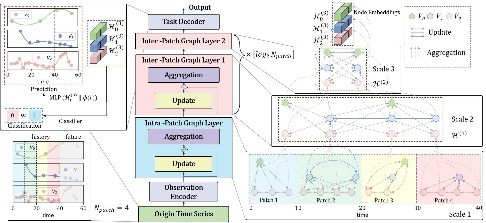

# Hi-Patch: Hierarchical Patch GNN for Irregularly Sampled Multivariate Time Series Modeling


## Overview

This repository contains implementation code for *Hi-Patch: Hierarchical Patch GNN for Irregularly Sampled Multivariate Time Series Modeling*.
We propose Hi-Patch to achieve multi-scale modeling for ISMTS and evaluate Hi-Patch on 8 datasets.

## The model framework of Hi-Patch




## Datasets

### Forecasting

We follow the benchmark on https://github.com/usail-hkust/t-PatchGNN and use four datasets: PhysioNet, MIMIC-III , Human Activity, and USHCN , covering the fields of healthcare, biomechanics, and climate science. 

For *Physionet* and *Human Activity*, our code will automatically download the raw data and preprocess them.

For *USHCN*, following the [GRU-ODE-Bayes](https://github.com/edebrouwer/gru_ode_bayes/tree/master), we use the same preprocessed data `small_chunked_sporadic.csv` as the raw data.

For *MIMIC*, because of the [PhysioNet Credentialed Health Data License](https://physionet.org/content/mimiciii/view-dua/1.4/), you need to first request the raw database from [here](https://physionet.org/content/mimiciii/1.4/). The database version we used here is v1.4. After downloading the raw data, following the preprocessing of [Neural Flows](https://github.com/mbilos/neural-flows-experiments/blob/master/nfe/experiments/gru_ode_bayes/data_preproc/mimic_prep.ipynb), you will finally get the `full_dataset.csv` which is used as the raw data in our experiment.

### Classification

We conduct experiments on four widely used irregular medical time series datasets, namely P19 , Physionet, MIMIC-III  and P12  where Physionet is a reduced version of P12 considered by prior work. 

#### Raw data

**(1)** The PhysioNet Sepsis Early Prediction Challenge 2019  dataset consists of medical records from 38,803 patients. Each patient's record includes 34 variables. For every patient, there is a static vector indicating attributes such as age, gender, the time interval between hospital admission and ICU admission, type of ICU, and length of stay in the ICU measured in days. Additionally, each patient is assigned a binary label indicating whether sepsis occurs within the subsequent 6 hours. We follow the procedures of \cite{zhang2021graph} to ensure certain samples with excessively short or long time series are excluded. The raw data is available at https://physionet.org/content/challenge-2019/1.0.0/

**(2)** The P12  dataset comprises data from 11,988 patients after 12 inappropriate samples identified by \cite{horn2020set} were removed from the dataset. Each patient's record in the P12 dataset includes multivariate time series data collected during their initial 48-hour stay in the ICU. The time series data consists of measurements from 36 sensors (excluding weight). Additionally, each sample is associated with a static vector containing 9 elements, including age, gender, and other relevant attributes. Furthermore, each patient in the P12 dataset is assigned a binary label indicating the length of their stay in the ICU. A negative label signifies a hospitalization period of three days or shorter, while a positive label indicates a hospitalization period exceeding three days.  Raw data of **P12** can be found at https://physionet.org/content/challenge-2012/1.0.0/.

**(3)** MIMIC-III The MIMIC-III dataset is a widely used database that comprises de-identified Electronic Health Records of patients who were admitted to the ICU at Beth Israel Deaconess Medical Center from 2001 to 2012. Originally, it encompassed around 57,000 records of ICU patients, containing diverse variables such as medications, in-hospital mortality, and vital signs. Harutyunyan established a variety of benchmark tasks using a subset of this database. In our study, we focus on the binary in-hospital mortality prediction task to assess classification performance. Following preprocessing, our dataset consists of 16 features and 21,107 data points. It is available at https://physionet.org/content/mimiciii/1.4/

**(4)** Physionet contains the data from the first 48 hours of patients in ICU which is a reduced version of P12 considered by prior work. Therefore, we follow the same preprocessing methods as those used for the P12 dataset. The processed data set includes 3997 labeled instances. We focus on predicting in-hospital. It is available at https://physionet.org/content/challenge-2012/

#### Processed data

For dataset P19 and P12. We use the data processed by [Raindrop](https://github.com/mims-harvard/Raindrop). 

The raw data can be found at:

**(1)** P19: https://physionet.org/content/challenge-2019/1.0.0/

**(2)** P12: https://physionet.org/content/challenge-2012/1.0.0/

The datasets processed by [Raindrop](https://github.com/mims-harvard/Raindrop) can be obtained at:

**(1)** P19 (PhysioNet Sepsis Early Prediction Challenge 2019) https://doi.org/10.6084/m9.figshare.19514338.v1

**(2)** P12 (PhysioNet Mortality Prediction Challenge 2012) https://doi.org/10.6084/m9.figshare.19514341.v1

For the MIMIC-III dataset:

1. Obtain the raw data from https://mimic.physionet.org/.
2. Execute the mortality prediction data preprocessing program from https://github.com/YerevaNN/mimic3-benchmarks to obtain the .csv files.
3. Run the data preprocessing code from https://github.com/ExpectationMax/medical_ts_datasets to obtain the .npy files.

For the PhysioNet dataset:

1. Obtain the raw data from https://physionet.org/content/challenge-2012/1.0.0/. Use only the set-a portion.

2. Execute the preprocessing file in data/physionet/process_scripts/.

   

## Requirements

Hi-Patch has tested using Python 3.9.19.

To have consistent libraries and their versions, you can install needed dependencies 
for this project running the following command:

```
pip install -r requirements.txt
```


## Running the code

After obtaining the dataset and corresponding variable representations, starting from subdirectory *Hi-Patch*, you can run models as follows:

### Forecasting

- Human Activity

The single run command for default horizon is:

```
python train_forecasting.py --dataset activity --state def --history 3000  --patience 10 --batch_size 32 --lr 1e-3 --patch_size 750 --stride 750 --nhead 1 --nlayer 3 --hid_dim 64 --seed 1 --gpu 0 --alpha 1
```

To evaluate performance across all horizons, execute the below command:

```
sh ./Hi-Patch/scripts/run_act.sh
```

- USHCN

The single run command for default horizon is:

```
python train_forecasting.py --dataset ushcn --state def --history 24 --patience 10 --batch_size 128 --lr 1e-3 --patch_size 1.5 --stride 1.5 --nhead 4  --nlayer 2 --hid_dim 64 --seed 1 --gpu 0 --alpha 1
```

To evaluate performance across all horizons, execute the below command:

```
sh ./Hi-Patch/scripts/run_ushcn.sh
```

- PhysioNet

The single run command for default horizon is:

```
python train_forecasting.py --dataset physionet --state def --history 24 --patience 10 --batch_size 64 --lr 1e-3 --patch_size 6 --stride 6 --nhead 1  --nlayer 1 --hid_dim 64 --seed 1 --gpu 0 --alpha 1
```

To evaluate performance across all horizons, execute the below command:

```
sh ./Hi-Patch/scripts/run_phy.sh
```

- MIMIC-III

The single run command for default horizon is:

```
python train_forecasting.py --dataset mimic --state def --history 24 --patience 10 --batch_size 8 --lr 1e-3 --patch_size 12 --stride 12 --nhead 1  --nlayer 1 --hid_dim 128 --seed 1 --gpu 0 --alpha 0.9
```

To evaluate performance across all horizons, execute the below command:

```
sh ./Hi-Patch/scripts/run_mic.sh
```

### Classification

- Physionet

```
python train_classification.py --dataset physionet --cuda 0 --epochs 20 --batch_size 16 --lr 0.0001 --nhead 8 --nlayer 2 --patch_size 24 --stride 24 --hid_dim 32
```

- P19

```
python train_classification.py --dataset P19 --cuda 1 --epochs 20 --batch_size 64 --lr 0.001 --nhead 4 --nlayer 1 --patch_size 3.75 --stride 3.75 --hid_dim 32
```

- P12

```
python train_classification.py --dataset P12 --cuda 1 --epochs 20 --batch_size 8 --lr 0.001 --nhead 1 --nlayer 2 --patch_size 6 --stride 6 --hid_dim 32
```

- MIMIC-III

```
python train_classification.py --dataset mimic3 --cuda 0 --epochs 20 --batch_size 16 --lr 0.001 --nhead 4 --nlayer 1 --patch_size 48 --stride 48 --hid_dim 16
```


Algorithms can be run with named arguments, which allow the use of different settings from the paper:

- *dataset*: Choose which dataset to use. Options: [activity, ushcn, physionet, mimic]
- *history*: Choose the historical horizon
- *patient*: Number of epochs for early stopping
- *batch-size*: Training batch size
- *lr*: Training learning rate
- *patch_size*: Patch size, corresponding to *P* in the paper
- *stride*: Stride of patch, we set it to be the same as the patch size
- *nhead*: The number of heads in multi-head attention
- *nlayer*: The number of layers in the graph attention network, corresponding to *L* in the paper.
- *hid_dim*: Dimension of graph node embedding, corresponding to *d_model* in the paper.
- *seed*: Random Seed
- *alpha*: Proportion of Time decay